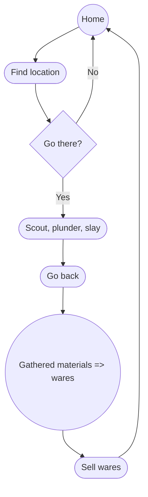

Tags: #game_tags/2D #game_tags/coop #game_tags/action #game_tags/roguelike #game_tags/sidescroller  

The Kaffestrig is a distillery/bakery situated on one of many [[01 - Projects/The World of Iridium/World Pillars|world pillars]] in the world of [[01 - Projects/Iridium/Iridium]]. In the events of this game, the distillery is renovated by four witches, going from a gloomy help center for [[Nordfolk|demons]] in need to a much warmer place that still offers the same services, and more.
## Gameplay

## Systems

### Day-night cycle

### [[01 - Projects/Kaffestrig/Inventory System|Inventory]]
Most humanoid characters will have a limited inventory space that they can access and equip items from. Held items will be displayed on the character, and depending on the item, can be used by the character to perform certain actions. An item needs to also be able to grant a character abilities.

## Art direction
Art style: Pixel art
Tile size: 8px

## Lore