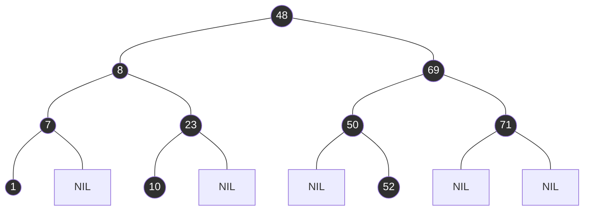

```swift
Array : [ _,_ , _,_ , _] //(Ein Array mit 5 leeren slots) 
front 0, rear 0 

enqueue(Q, 8); 
Array : [ 8,_ , _,_ , _] //(Erster slot wird mit 8 belegt) 
front 0, rear 1 

enqueue(Q, 7); 
Array : [ 8, 7,_ , _,_ ] //(Zweiter slot wird mit 7 belegt) 
front 0, rear 2 

enqueue(Q, 6); 
Array : [ 8, 7, 6, _,_ ] //(Dritter slot wird mit 6 belegt) 
front 0, rear 3 

dequeue(Q) 
Array : [ _, 7, 6,_ , _] //(Erster slot wird entfernt) 
front 1, rear 3 

dequeue(Q) 
Array : [_ , _, 6,_ , _] //(Zweiter slot wird entfernt, da er jetzt der vorderste ist) 
front 2, rear 3 

enqueue(Q, 7); 
Array : [_ , _, 6, 7,_ ] //(Vierter slot wird mit 7 belegt, da er der erste freie hinter 6(front) ist) 
front 2, rear 4 

enqueue(Q, 2); 
Array : [ _,_ , 6, 7, 2 ] //(Fünfer slot wird mit 2 belegt) 
front 2, rear 0 

dequeue(Q); 
Array : [ _,_ , _, 7, 2 ] //(Dritter slot wird entfernt ) 
front 3, rear 0 

Endergebnis Array : [_ , _,_ , 7, 2 ] //(Dritter slot wird entfernt ) 
front 3, rear 0
```



```swift
rotateLeft(T, root)

y = root.right;
root.right = y.left;

if y.left != nil THEN:
	y.left.parent = root;

IF root.parent == T.sent THEN
	T.root = y;
ELSE
	IF root == root.parent.left THEN
		root.parent.left = y;
	ELSE
		root.parent.right = y;
y.left = root;
root.parent = y;
```

![[99 - Meta/01 - Images/Pasted image 20240531192204.png]]

```python

def create_binary(list) -> void:
	for entry in list:
		

```